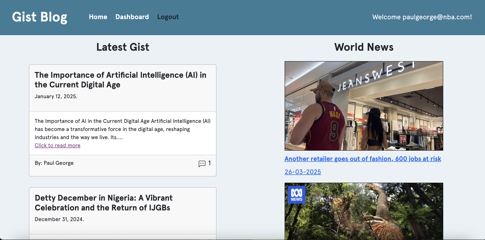
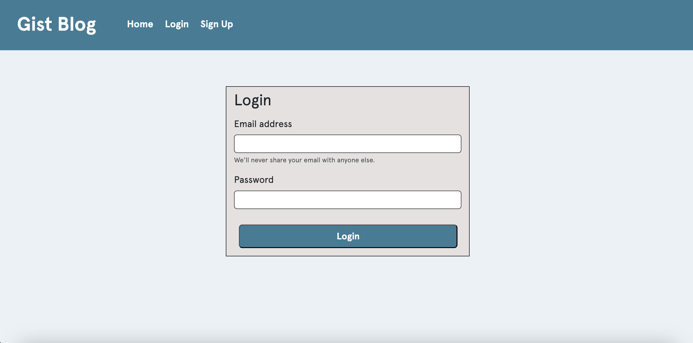
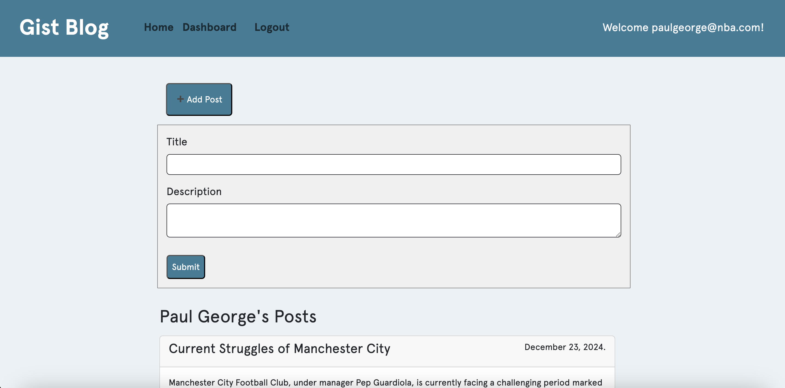

## Gist Blog

[](https://opensource.org/licenses/MIT)
## Project Description
Gist Blog is an interactive platform designed for users to post articles, share their thoughts, and engage in discussions on various topics. This blog allows news enthusiasts to sign up or log in (for existing users) and publish news articles. Additionally, users can comment on articles posted by others, fostering a dynamic and engaging community.
## Motivation
I was inspired to create this project to provide a space where users can freely express their thoughts on current events and societal issues. Gist Blog serves as a forum where meaningful discussions can take place.

The project was developed using *Express.JS* for routing and *MySQL* for database structure. It also incorporated code libraries such as *sequelize* for ORM, *express.handlebars* for templating, *node.js* for backend operations e.t.c. The backend includes the database for all Users, Posts and Comments, along with *API* routes that utilize CRUD (Create, Read, Update and Delete) functionality. Styling was based mostly on *Bootstrap 5*, including *Bootstrap Icons*.


## Live Application
Click [here](https://polar-retreat-55591-2059c19c0b3a.herokuapp.com/) to view the application
## Table of Contents
- [User Story](#user-story)
- [Acceptance Criteria](#acceptance-criteria)
- [Usage](#usage)
- [License](#license)
- [Tests](#tests)

## User Story

```
As a Social Blogger,
I want to share opinions on various issues affecting society with fellow enthusiasts
So that I can engage with a community of like-minded individuals,

I want to publish articles on diverse topics
So that other users can read these articles and share their thoughts.

```

## Acceptance Criteria
```
GIVEN I open the web application
WHEN I visit the homepage
THEN I see a navigation bar with options: "Home," "Login," and "Signup."

WHEN I click "Login" or "Signup,"
THEN I am directed to respective pages for authentication.

WHEN I successfully log in or sign up,
THEN I am redirected to the homepage, with "Logout" appearing in the navigation bar.

WHEN I click "Read More" on any article,
THEN I can view the full article along with comments and an option to add my own comment.

WHEN I submit a comment,
THEN my comment appears under the article alongside others.

WHEN I click on "Dashboard,"
THEN I am taken to my profile dashboard, where I can create and manage my posts.

WHEN I submit a new article,
THEN it is displayed on both the homepage and my dashboard.

WHEN I try to access an article without logging in,
THEN I am prompted to log in to read the full content.
```


## Usage
Users can explore the homepage to browse recent articles. However, they need to sign up to read full articles and interact with content. Once logged in, users can:

- Publish new articles

- Read full articles

- Comment on articles

- View their personal dashboard

## Screenshots
Homepage:



You can login:



And post your article...




## Credits
Web app developed by Kanayochi Ifediora.

## License
This project is licensed under the MIT license.

## Questions
Any questions? please contact me via e-mail at anayoifediora@live.com

- [Github username](https://github.com/anayoifediora)
- [Project Github Repo](https://github.com/anayoifediora/News_blog)